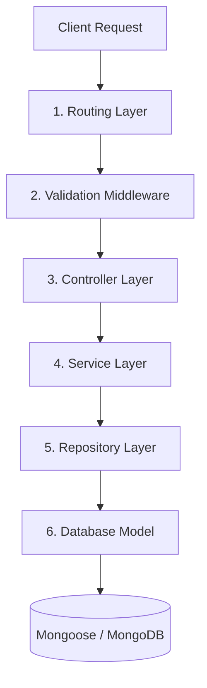

# Backend API Data Flow Documentation

This document explains the end-to-end request and response lifecycle in the Trouvailler backend project (`trouvailler-api`). Use this as a reference guide to understand the architecture or when adding new features and routes.

---

## 1. Architectural Layers Overview

The application follows a clean, decoupled **Layered Architecture**:



| Layer          | Responsibility                                             | Directory       | Example                                                                                                                                         |
| :------------- | :--------------------------------------------------------- | :-------------- | :---------------------------------------------------------------------------------------------------------------------------------------------- |
| **Routing**    | Maps HTTP paths/methods to Controller actions.             | `routes/`       | [CategoryRoutes.js](file:///Users/jaisonjoshi/Documents/Personal%20Projects/Trouvailler/trouvailler-api/routes/CategoryRoutes.js)               |
| **Validation** | Zod schemas describing and validating JSON payloads.       | `validation/`   | [CategoryValidation.js](file:///Users/jaisonjoshi/Documents/Personal%20Projects/Trouvailler/trouvailler-api/validation/CategoryValidation.js)   |
| **Controller** | Handles HTTP req/res, extracts params, calls Services.     | `controllers/`  | [CategoryController.js](file:///Users/jaisonjoshi/Documents/Personal%20Projects/Trouvailler/trouvailler-api/controllers/CategoryController.js)  |
| **Service**    | Implements core business logic, checks unique constraints. | `services/`     | [CategoryService.js](file:///Users/jaisonjoshi/Documents/Personal%20Projects/Trouvailler/trouvailler-api/services/CategoryService.js)           |
| **Repository** | Database query abstraction. Isolates Mongoose queries.     | `repositories/` | [CategoryRepository.js](file:///Users/jaisonjoshi/Documents/Personal%20Projects/Trouvailler/trouvailler-api/repositories/CategoryRepository.js) |
| **Model**      | Mongoose Schema definition defining MongoDB collections.   | `models/`       | [Category.js](file:///Users/jaisonjoshi/Documents/Personal%20Projects/Trouvailler/trouvailler-api/models/Category.js)                           |

---

## 2. End-to-End Request Lifecycle (Category Example)

### Step A: Entry Point and Route Mounting

All HTTP requests enter through [app.js](file:///Users/jaisonjoshi/Documents/Personal%20Projects/Trouvailler/trouvailler-api/app.js) and are redirected to the corresponding route middleware module:

```javascript
import categoryRoutes from "./routes/CategoryRoutes.js";
app.use("/api/categories", categoryRoutes);
```

### Step B: Routing and Input Validation

When a `POST /api/categories` request arrives at [CategoryRoutes.js](file:///Users/jaisonjoshi/Documents/Personal%20Projects/Trouvailler/trouvailler-api/routes/CategoryRoutes.js), it first runs the `validateBody` middleware using the Zod schema from [CategoryValidation.js](file:///Users/jaisonjoshi/Documents/Personal%20Projects/Trouvailler/trouvailler-api/validation/CategoryValidation.js):

```javascript
router.post("/", validateBody(createCategorySchema), CategoryController.create);
```

- If the body fails validation, `validateBody` immediately returns a `400 Bad Request` containing Zod issues.
- If it passes, the request proceeds to `CategoryController.create`.

### Step C: Controller Handling

The [CategoryController.js](file:///Users/jaisonjoshi/Documents/Personal%20Projects/Trouvailler/trouvailler-api/controllers/CategoryController.js) extracts payloads/params and calls the Service layer. Asynchronous errors are passed to the global error handler using `next(err)`:

```javascript
async create(req, res, next) {
  try {
    const newCategory = await CategoryService.createCategory(req.body);
    res.status(201).json(newCategory);
  } catch (err) {
    next(err);
  }
}
```

### Step D: Service / Business Logic

The [CategoryService.js](file:///Users/jaisonjoshi/Documents/Personal%20Projects/Trouvailler/trouvailler-api/services/CategoryService.js) runs Zod `.parse()` again for safety (defense-in-depth), performs database uniqueness checks, and handles errors:

```javascript
async createCategory(data) {
  const validatedData = createCategorySchema.parse(data);
  const existing = await CategoryRepository.findByName(validatedData.name);
  if (existing) {
    const error = new Error("Category name already exists");
    error.statusCode = 400;
    throw error;
  }
  return await CategoryRepository.create(validatedData);
}
```

### Step E: Repository Database Access

The [CategoryRepository.js](file:///Users/jaisonjoshi/Documents/Personal%20Projects/Trouvailler/trouvailler-api/repositories/CategoryRepository.js) interacts directly with Mongoose's active Model, keeping query details out of services:

```javascript
async create(data) {
  const newCategory = new Category(data);
  return await newCategory.save();
}
```

### Step F: Database Document Model

The Mongoose Schema defined in [Category.js](file:///Users/jaisonjoshi/Documents/Personal%20Projects/Trouvailler/trouvailler-api/models/Category.js) maps the validated javascript object directly into a document inside MongoDB:

```javascript
const categorySchema = new mongoose.Schema(
  {
    name: { type: String, required: true, unique: true, trim: true },
    description: { type: String, required: true, trim: true },
    image: { type: String, required: true },
  },
  { timestamps: true },
);
```

---

## 3. Dynamic Swagger/OpenAPI Spec Conversion

API reference documentation is automatically generated:

1. Route endpoints and parameters are annotated in code via inline JSDoc comments starting with `* @openapi` inside [CategoryRoutes.js](file:///Users/jaisonjoshi/Documents/Personal%20Projects/Trouvailler/trouvailler-api/routes/CategoryRoutes.js).
2. JSON component schemas are built dynamically from Zod schemas inside [swagger.js](file:///Users/jaisonjoshi/Documents/Personal%20Projects/Trouvailler/trouvailler-api/utils/swagger.js):
   ```javascript
   swaggerSpec.components.schemas.Category = z.toJSONSchema(createCategorySchema, {
     target: "openapi-3.0",
   });
   ```
3. These OpenAPI-compliant specifications are registered in [app.js](file:///Users/jaisonjoshi/Documents/Personal%20Projects/Trouvailler/trouvailler-api/app.js) and displayed interactively on the `/docs` endpoint.

---

## 4. Checklist for Adding New Features

When adding new routes (e.g. `Destinations`), follow these steps:

1. **Model**: Define the Mongoose schema inside `models/`.
2. **Validation**: Define Zod schemas inside `validation/`.
3. **Repository**: Create database operation methods in `repositories/`.
4. **Service**: Write validation checks and business logic in `services/`.
5. **Controller**: Write route action methods in `controllers/`.
6. **Routes**: Define paths, apply `validateBody` middleware, and write `@openapi` comments in `routes/`.
7. **Mount**: Mount the router in `app.js` using `app.use()`.
8. **Swagger**: Export and map Zod schemas in `utils/swagger.js`.
9. **Regenerate Graphs**: Run `npm run graph` inside the `trouvailler-api` workspace directory to index the new codebase files.
