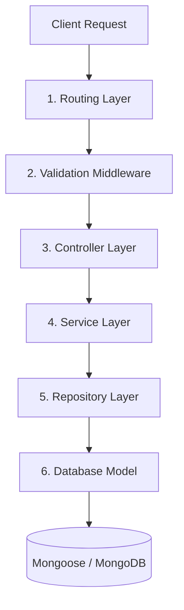

# Backend API Data Flow Documentation

This document explains the end-to-end request and response lifecycle in the Trouvailler backend project (`trouvailler-api`). Use this as a reference guide to understand the architecture or when adding new features and routes.

---

## 1. Architectural Layers Overview

The application follows a clean, decoupled **Layered Architecture**:


```mermaid
graph TD
    Client[Client Request] --> Router[1. Routing Layer]
    Router --> Middleware[2. Validation Middleware]
    Middleware --> Controller[3. Controller Layer]
    Controller --> Service[4. Service Layer]
    Service --> Repository[5. Repository Layer]
    Repository --> Model[6. Database Model]
    Model --> MongoDB[(Mongoose / MongoDB)]
```

| Layer          | Responsibility                                             | Directory       | Example                                                                                                                                         |
| :------------- | :--------------------------------------------------------- | :-------------- | :---------------------------------------------------------------------------------------------------------------------------------------------- |
| **Routing**    | Maps HTTP paths/methods to Controller actions.             | `routes/`       | [CategoryRoutes.js](file:///Users/jaisonjoshi/Documents/Personal%20Projects/Trouvailler/trouvailler-api/routes/CategoryRoutes.js)               |
| **Validation** | Zod schemas describing and validating JSON payloads.       | `validation/`   | [CategoryValidation.js](file:///Users/jaisonjoshi/Documents/Personal%20Projects/Trouvailler/trouvailler-api/validation/CategoryValidation.js)   |
| **Controller** | Handles HTTP req/res, extracts params, calls Services.     | `controllers/`  | [CategoryController.js](file:///Users/jaisonjoshi/Documents/Personal%20Projects/Trouvailler/trouvailler-api/controllers/CategoryController.js)  |
| **Service**    | Business rules, orchestration, uniqueness checks, cross-entity validation, algorithm logic, coordinates repositories. | `services/`     | [CategoryService.js](file:///Users/jaisonjoshi/Documents/Personal%20Projects/Trouvailler/trouvailler-api/services/CategoryService.js)           |
| **Repository** | Persistence logic only. Isolates Mongoose queries. Contains no business rules or request validation. | `repositories/` | [CategoryRepository.js](file:///Users/jaisonjoshi/Documents/Personal%20Projects/Trouvailler/trouvailler-api/repositories/CategoryRepository.js) |
| **Model**      | Mongoose Schema definition defining MongoDB collections.   | `models/`       | [Category.js](file:///Users/jaisonjoshi/Documents/Personal%20Projects/Trouvailler/trouvailler-api/models/Category.js)                           |

### 1.1 Application Startup Flow

Application initialization follows a separate flow that runs once at startup, before any requests are processed:


```mermaid
graph TD
    Start[Application Start] --> DB[MongoDB Connection]
    DB --> BS[BootstrapService.run&#40;&#41;]
    BS --> Ensure[Ensure Home Page Exists]
    Ensure --> Server[Express Starts Accepting Requests]
```

This ensures required system data exists before the API begins serving traffic, eliminating lazy initialization side effects from request handlers.

---

## 2. End-to-End Request Lifecycle (Category Example)

### Step A: Entry Point and Route Mounting

All HTTP requests enter through [app.js](file:///Users/jaisonjoshi/Documents/Personal%20Projects/Trouvailler/trouvailler-api/app.js) and are redirected to the corresponding route middleware module:

```javascript
import categoryRoutes from "./routes/CategoryRoutes.js";
app.use("/api/categories", categoryRoutes);
```

### Step B: Routing and Input Validation

When a `POST /api/categories` request arrives at [CategoryRoutes.js](file:///Users/jaisonjoshi/Documents/Personal%20Projects/Trouvailler/trouvailler-api/routes/CategoryRoutes.js), it first runs the `validateBody` middleware using the Zod schema from [CategoryValidation.js](file:///Users/jaisonjoshi/Documents/Personal%20Projects/Trouvailler/trouvailler-api/validation/CategoryValidation.js):

```javascript
router.post("/", validateBody(createCategorySchema), CategoryController.create);
```

- If the body fails validation, `validateBody` immediately returns a `400 Bad Request` containing Zod issues.
- If it passes, the request proceeds to `CategoryController.create`.

### Step C: Controller Handling

The [CategoryController.js](file:///Users/jaisonjoshi/Documents/Personal%20Projects/Trouvailler/trouvailler-api/controllers/CategoryController.js) extracts payloads/params and calls the Service layer. Asynchronous errors are passed to the global error handler using `next(err)`:

```javascript
async create(req, res, next) {
  try {
    const newCategory = await CategoryService.createCategory(req.body);
    res.status(201).json(newCategory);
  } catch (err) {
    next(err);
  }
}
```

### Step D: Service / Business Logic

The [CategoryService.js](file:///Users/jaisonjoshi/Documents/Personal%20Projects/Trouvailler/trouvailler-api/services/CategoryService.js) orchestrates business rules, validates data (often running Zod `.parse()` as defense-in-depth), performs uniqueness checks, and coordinates repositories:

```javascript
async createCategory(data) {
  const validatedData = createCategorySchema.parse(data);
  await this._ensureUniqueName(validatedData.name);
  return CategoryRepository.create(validatedData);
}
```

### Step E: Repository Database Access

The [CategoryRepository.js](file:///Users/jaisonjoshi/Documents/Personal%20Projects/Trouvailler/trouvailler-api/repositories/CategoryRepository.js) interacts directly with Mongoose's active Model, keeping query details out of services:

```javascript
async create(data) {
  const newCategory = new Category(data);
  return await newCategory.save();
}
```

### Step F: Database Document Model

The Mongoose Schema defined in [Category.js](file:///Users/jaisonjoshi/Documents/Personal%20Projects/Trouvailler/trouvailler-api/models/Category.js) maps the validated javascript object directly into a document inside MongoDB:

```javascript
const categorySchema = new mongoose.Schema(
  {
    name: { type: String, required: true, unique: true, trim: true },
    description: { type: String, required: true, trim: true },
    image: { type: String, required: true },
  },
  { timestamps: true },
);
```

### 2.7 Service Conventions

Services across the project follow consistent patterns:

- **Public orchestration methods** (`create`, `update`, `getAll`, `getById`, `delete`) accept plain data, delegate to repositories, and handle errors.
- **Private helper methods** (prefixed with `_`) encapsulate reusable logic:
  - `_ensureUnique...` — validates no duplicate slug/name/title exists before creation or update.
  - `_ensure...Exist` — validates that referenced entities exist before persisting (e.g. packages in a section).
  - `_apply...Constraint` — applies derived field values (e.g. auto-disable a section when its entity list is empty).
- Repositories are called only from services. Controllers never interact with repositories directly.
- Controllers remain thin — they extract request data, call one service method, and return the response.
- Most services export a singleton (`export default new ServiceName()`) since they are stateless.

---

## 3. Startup Initialization

### BootstrapService

[`services/BootstrapService.js`](file:///Users/jaisonjoshi/Documents/Personal%20Projects/Trouvailler/trouvailler-api/services/BootstrapService.js) handles one-time application initialization tasks. Its responsibilities are:

- **System data seeding** — Ensures required system records exist. Currently this is the Home page.
- **Idempotency** — If a record already exists (e.g. from a previous startup), BootstrapService skips creation safely.

The `run()` method is called in `index.js` immediately after `mongoose.connect()` resolves and before `app.listen()` executes:

```javascript
mongoose.connect(MONGO_URI).then(async () => {
  await BootstrapService.run();
  app.listen(PORT, HOST, () => { ... });
});
```

Because initialization happens at startup, request handlers no longer create database records as a side effect.

---

## 4. Dynamic Swagger/OpenAPI Spec Conversion

API reference documentation is automatically generated:

1. Route endpoints and parameters are annotated in code via inline JSDoc comments starting with `* @openapi` inside [CategoryRoutes.js](file:///Users/jaisonjoshi/Documents/Personal%20Projects/Trouvailler/trouvailler-api/routes/CategoryRoutes.js).
2. JSON component schemas are built dynamically from Zod schemas inside [swagger.js](file:///Users/jaisonjoshi/Documents/Personal%20Projects/Trouvailler/trouvailler-api/utils/swagger.js):
   ```javascript
   swaggerSpec.components.schemas.Category = z.toJSONSchema(createCategorySchema, {
     target: "openapi-3.0",
   });
   ```
3. These OpenAPI-compliant specifications are registered in [app.js](file:///Users/jaisonjoshi/Documents/Personal%20Projects/Trouvailler/trouvailler-api/app.js) and displayed interactively on the `/docs` endpoint.

---

## 5. Checklist for Adding New Features

When adding new routes (e.g. `Destinations`), follow these steps:

1. **Model**: Define the Mongoose schema inside `models/`.
2. **Validation**: Define Zod schemas inside `validation/`.
3. **Repository**: Create database operation methods in `repositories/`.
4. **Service**: Write validation checks and business logic in `services/`.
5. **Controller**: Write route action methods in `controllers/`.
6. **Routes**: Define paths, apply `validateBody` middleware, and write `@openapi` comments in `routes/`.
7. **Mount**: Mount the router in `app.js` using `app.use()`.
8. **Swagger**: Export and map Zod schemas in `utils/swagger.js`.
9. **Regenerate Graphs**: Run `npm run graph` inside the `trouvailler-api` workspace directory to index the new codebase files.
10. **BootstrapService**: If the feature introduces required system data (e.g. a default page or configuration record), register its initialization in `services/BootstrapService.js`.
