# Trouvailler Search Engine Optimization (SEO) Architecture Documentation

This document describes how SEO metadata flows end-to-end through the Trouvailler ecosystem: from the Admin dashboard, through the Express API and MongoDB, into the Next.js frontend, and finally to browsers and search engines.

---

## 1. System Architecture Overview

```mermaid
graph TD
    Admin[Admin Dashboard] -->|Edits SEO fields| API[trouvailler-api / Express]
    API -->|Zod Validation| Controller[Controller]
    Controller --> Service["Service Layer<br/>(orchestration)"]
    Service --> Repo[Repository Layer]
    Repo --> MongoDB[(MongoDB)]
    
    subgraph Startup
        BS[BootstrapService.run&#40;&#41;] -->|Ensures Home page exists| MongoDB
    end

    Next[Next.js Frontend] -->|API request| API
    Next -->|generateMetadata&#40;&#41;| FSL[Frontend Service Layer]
    FSL -->|fetch data| API
    
    MongoDB -->|seo data| API
    API -->|JSON response| Next
    Next -->|HTML meta tags| Browser[Browser / Search Engine]
```



### Lifecycle

1. An administrator edits SEO fields in the Admin dashboard and saves.
2. The Express API validates the payload through Zod middleware, passes it through a thin controller to the service layer, which delegates to the repository for persistence.
3. SEO metadata is stored as a nested `seo` object on the entity document in MongoDB.
4. At application startup, `BootstrapService` ensures required system content (currently the Home page) exists so its SEO metadata is available immediately.
5. When a visitor requests a page, the Next.js server component calls `generateMetadata()`, which invokes the frontend service layer.
6. The frontend service layer fetches the entity data (including SEO metadata) from the Express API.
7. `generateMetadata()` returns the resolved metadata, Next.js renders it into HTML `<title>` and `<meta>` tags, and the browser/search engine receives them.

---

## 2. Backend Architecture

### Data Model

SEO metadata is stored as a nested `seo` sub-document on supported entities (Category, Location, Page). Each `seo` block contains:

| Field | Type | Default | Purpose |
|---|---|---|---|
| `title` | `String` | `""` | Custom browser tab title |
| `description` | `String` | `""` | Meta description for search snippets |
| `keywords` | `String` | `""` | Comma-separated keywords |

### Validation

Zod schemas define the shape and constraints of the `seo` object. Validation is enforced at the route layer via `validateBody` middleware, returning `400` on malformed input before the request reaches the controller.

### Request Flow

```
HTTP Request → Route Middleware (validateBody) → Controller → Service → Repository → MongoDB
```

| Layer | Responsibility |
|---|---|
| **Controller** | Thin — extracts request data, calls one service method, returns the response. |
| **Service** | Orchestrates business logic, coordinates uniqueness checks, delegates to repositories. |
| **Repository** | Persistence only — isolates Mongoose queries, contains no business rules. |

Services use private helpers (prefixed with `_`) for reusable logic such as uniqueness checks and existence validation. Errors are thrown via a `throwError()` helper that attaches a `statusCode`.

---

## 3. Admin Architecture

Administrators manage SEO metadata through a shared editor component embedded in entity-specific pages.

### SEO Editor Component

- **Live SERP preview** — A mock Google search result card updates in real time as the administrator types.
- **Character count guidance** — Visual counters indicate the current length of the title and description.
- **Recommended ranges** — Titles should be 50–60 characters; descriptions should be 120–155 characters.
- **Keyword formatting** — Comma-separated keywords are displayed as styled tags (e.g. `#bali`, `#beach-villa`) in the preview.

### Supported Entities

Editors for the following entities include the SEO editor:

- **Categories** — Custom metadata for category listing and detail pages.
- **Locations** — Custom metadata for destination and location pages.
- **Packages** — Custom metadata for package itinerary pages.
- **Home Page** — Metadata for the root landing page, managed through the system page builder.

### Workflow

1. Navigate to the entity's editor page in the Admin dashboard.
2. Open the SEO section.
3. Fill in the title, description, and keywords fields.
4. Observe the live SERP preview and character counts.
5. Save — the data is submitted to the Express API and stored in MongoDB.

---

## 4. Frontend Metadata Pipeline

The Next.js frontend uses the App Router with Server Components to generate SEO metadata dynamically on every request.

### Flow

```mermaid
graph LR
    Browser[Browser Request] --> SC[Next.js Server Component]
    SC --> GM[generateMetadata&#40;&#41;]
    GM --> FSL[Frontend Service Layer]
    FSL --> API["Express API<br/>(trouvailler-api)"]
    API --> FSL
    FSL --> GM
    GM --> HTML[HTML &lt;head&gt; metadata]
    HTML --> Browser
```



### Components

- **`generateMetadata()`** — An async function exported from each route's `page.tsx`. It receives the route params, fetches the entity via the frontend service layer, and returns a `Metadata` object containing `title`, `description`, and `keywords`.
- **Frontend Service Layer** — A shared module that abstracts API calls. It uses React's `cache()` to deduplicate requests that are made both during metadata generation and page rendering, avoiding redundant network calls within a single request.
- **Server Components** — The page body receives the same data fetched during metadata generation, passed down as props.

### Dynamic Routes

Metadata is generated dynamically for:

| Route | Entity | Data Source |
|---|---|---|
| `/` | Home Page | Page API (`slug=home`) |
| `/categories/:slug` | Category | Category API |
| `/destinations/:id` | Location | Location API |
| `/packages/:id` | Package | Package API |

---

## 5. Metadata Resolution

When the frontend renders a page, SEO metadata is resolved using the following precedence:

```
Custom SEO metadata (stored in database)
         ↓
Entity defaults (name, description, summary)
         ↓
Application defaults (site name, fallback description)
```

| Priority | Source | Example |
|---|---|---|
| 1 (highest) | Custom `seo.title` / `seo.description` | "Bali Luxury Villa Packages" |
| 2 | Entity field (name, description, summary) | Package name or category description |
| 3 (lowest) | Hardcoded application fallbacks | "Trouvailler — Discover Your Next Adventure" |

If a custom SEO title is empty, the system falls back to the entity's own name or title. If that is also unavailable, a general application default is used. This ensures every page always produces meaningful metadata without requiring manual input.

---

## 6. Bootstrap Initialization

`BootstrapService` runs once during application startup, after MongoDB connects and before the Express server begins accepting requests.

```javascript
mongoose.connect(MONGO_URI).then(async () => {
  await BootstrapService.run();  // <--
  app.listen(PORT, HOST, ...);
});
```

### Responsibilities

- **System data seeding** — Ensures required system records exist. Currently this is the Home page.
- **Idempotency** — If a record already exists (from a prior startup), BootstrapService skips creation.
- **Side-effect-free handlers** — Because initialization happens at startup, request handlers no longer create database records lazily. The Home page — and its SEO metadata — is guaranteed to exist on a brand-new database without waiting for the first API request.

---

## 7. Best Practices

Content managers and developers should follow these guidelines when working with SEO metadata:

| Field | Recommended Length | Notes |
|---|---|---|
| **Title** | 50–60 characters | Longer titles are truncated in search results. |
| **Description** | 120–155 characters | Provides enough context for a rich snippet without truncation. |
| **Keywords** | Optional | Treated as supplementary metadata, not a primary ranking signal. |

- **Avoid duplicate metadata** — Every page should have a unique title and description.
- **Write for users, not search engines** — Descriptions should accurately summarize the page content and encourage clicks, not stuff keywords.
- **Keywords are optional** — Modern search engines place little weight on the keywords meta tag. Use it as an internal tagging mechanism rather than an SEO strategy.
- **Test with previews** — Use the live SERP preview in the Admin panel to verify how metadata appears before publishing.
