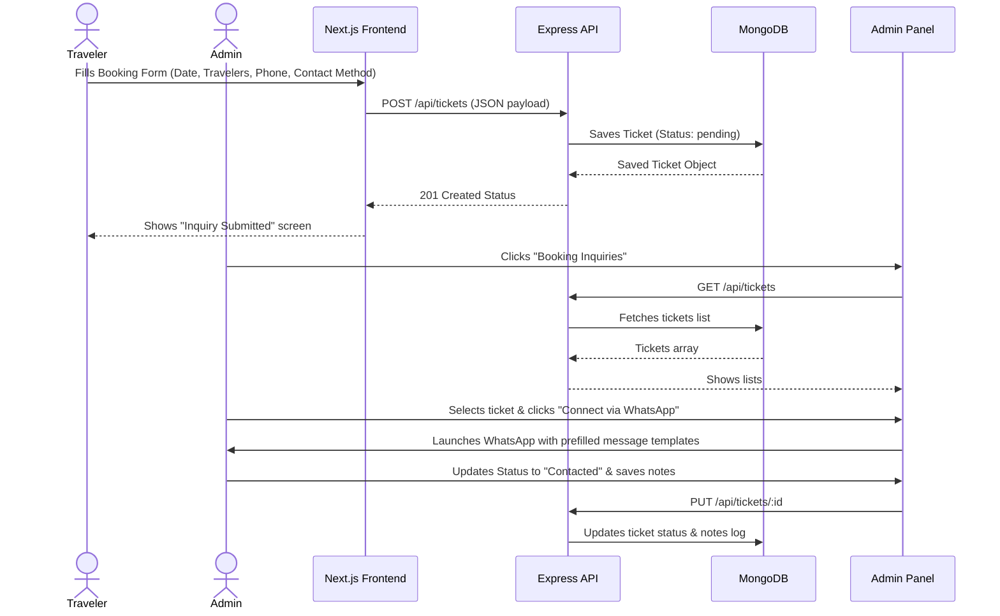

# Trouvailler Booking Inquiry Ticket System Documentation

This document describes the design, database schema, frontend forms, and management dashboard built for the Trouvailler tour booking inquiry system.

---

## 1. Interaction Workflow

---

## 2. Data Structure Model Schema (`Ticket`)

Inquiries are stored inside the `tickets` collection in MongoDB.

### Database Attributes
* **`packageName`** (`String`, required): The exact name of the interested tour.
* **`packagePrice`** (`String`, required): Starting package price.
* **`date`** (`String`, required): Preferred travel date.
* **`travelers`** (`String`, required): Count of travelers.
* **`name`** (`String`, required): Traveler's full name.
* **`email`** (`String`, required): Lowercase, validated email address.
* **`phone`** (`String`, required): Contact phone number.
* **`contactMethod`** (`String`, enum: `["email", "phone", "whatsapp"]`): Method preferred by user.
* **`status`** (`String`, enum: `["pending", "contacted", "resolved", "cancelled"]`, default: `"pending"`): Current action state of the inquiry.
* **`notes`** (`String`, default: `""`): Conversation history and customized quote updates log.
* **`timestamps`** (`Boolean`): Automatically manages `createdAt` and `updatedAt`.

### Database Indexes
* `{ status: 1 }`
* `{ email: 1 }`
* `{ createdAt: -1 }` (Serves most recent requests first)

---

## 3. Frontend Inquiry Submission Form

Form components are managed in the dynamic Next.js App Router:
* **File Location**: [BookingForm.tsx](file:///Users/jaisonjoshi/Documents/Personal%20Projects/Trouvailler/trouvailler-frontend/components/BookingForm.tsx)
* **Form Parameters**:
  * Date Picker.
  * Traveler Dropdown selector.
  * Text Fields for Full Name, Email, and Phone.
  * Dropdown selector for preferred contact method.
* **Submission Engine**: Submits JSON payloads to `${API_URL}/api/tickets` via standard HTTP Fetch. Handles loading states and provides validation feedback.

---

## 4. Admin Management Dashboard

The dashboard provides tools to monitor and act on traveler inquiries:
* **Sidebar Menu**: Registered under [Sidebar.tsx](file:///Users/jaisonjoshi/Documents/Personal%20Projects/Trouvailler/trouvailler-admin/src/components/Sidebar.tsx#L19-L20) with active inbox badges.
* **Table View**: Lists traveler name, target packages, travel date, traveler count, contact methods, and current status. Supports live text search and status-based tabs.
* **Detail Inspector Panel**: Renders on the right when an inquiry is selected:
  * Shows all collected submission fields.
  * **Connect Actions**:
    * **Email**: Quick trigger for `mailto:${email}?subject=Trouvailler Inquiry` clients.
    * **Phone**: Quick trigger for `tel:${phone}` phone dialer links.
    * **WhatsApp**: Opens WhatsApp Web (`wa.me`) pre-populated with a templates message:
      > *"Hi [Name], This is Trouvailler Travel team. Thank you for your inquiry about the [Package Name] tour package..."*
  * **Status Updater**: Instant state update dropdown menu.
  * **Notes Notepad**: Custom textarea to document customer preferences.

---

## 5. Administrative Best Practices

1. **Daily Reviews**: Check for `"pending"` tickets in the sidebar daily.
2. **Conversation Auditing**: Always add updates (e.g., *"Called on July 7, agreed to adjust itinerary to 6 days"* or *"Sent customized PDF quote"*) in the **Action notes** panel and click **Save Action Notes** to record progress.
3. **Closing Tickets**: Once booking deposits are finalized, update status to `"resolved"`. If the traveler declines, change status to `"cancelled"`.
